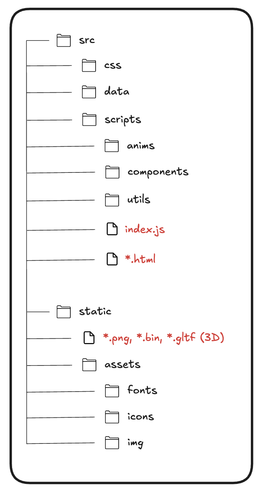

# Furni - 2025 ©

Furni est un site e-commerce spécialisé dans la vente de meubles et d'articles de décoration pour la maison.

## Déploiement
Le site est déployé sur Vercel et accessible à l'adresse suivante : [https://furni-2025.vercel.app/](https://furni-2025.vercel.app/)

## Technologies et outils utilisés
- Frontend : HTML, CSS, JavaScript
- Animations : Three.js (3D) et GSAP
- Vite : outil de build et de déploiement
- Figma
- Vercel

## Organisation technique

### Arborescence

### Pages finales

[PAGES.md](./README/PAGES.md)